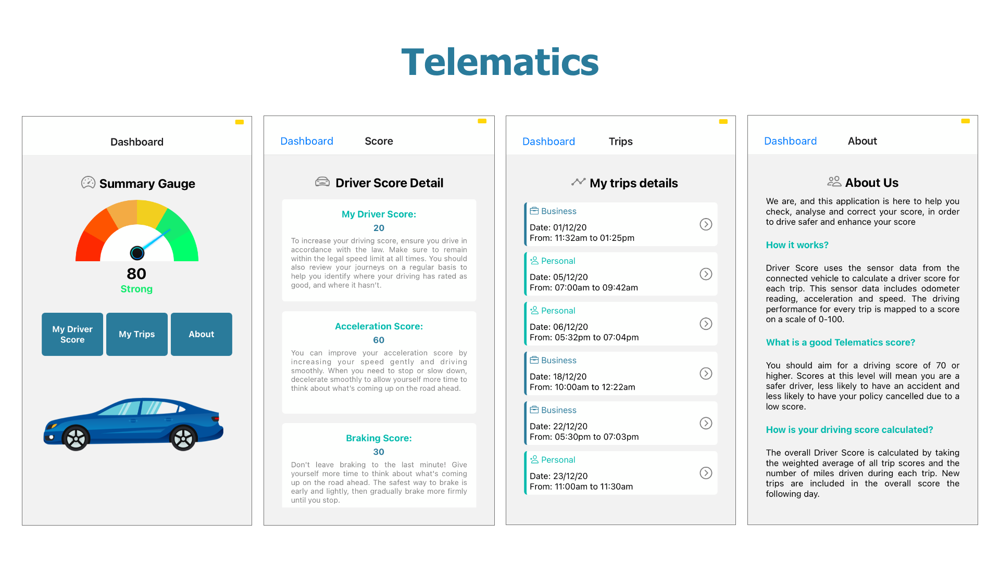

# Telematics

## run the application

- Clone the project
- in the CLI, run "npm install"
- Download "Expo" on your phone (click here for [iOs](https://apps.apple.com/gb/app/expo-client/id982107779) or [Android](https://play.google.com/store/apps/details?id=host.exp.exponent&hl=en_GB&gl=US)
- In the CLI, run "npm start"
- With your phone camera, or with the Expo app, scan the QR code that appears either on the browser or the CLI
- Enjoy!

### Features

- Dashboard page
- My driver score page
- My trips page
- About page

### Tech Stack

- React Native (Expo)
- Npm
- Git